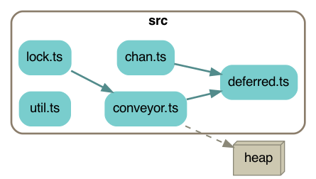

# Concurrency friends

3 helpful tools for concurrency.  They are similar but are designed for different use cases.

Status: tested, working, but not production ready.

<!-- START doctoc generated TOC please keep comment here to allow auto update -->
<!-- DON'T EDIT THIS SECTION, INSTEAD RE-RUN doctoc TO UPDATE -->
**Contents**

- [Install](#install)
- [Overview](#overview)
  - [Chan](#chan)
    - [PUT](#put)
    - [GET](#get)
  - [Conveyor](#conveyor)
  - [Mutex](#mutex)
- [Chan in detail](#chan-in-detail)
- [Conveyor in detail](#conveyor-in-detail)
- [Mutex in detail](#mutex-in-detail)
  - [Return values](#return-values)
  - [Errors](#errors)
  - [PriorityMutex](#prioritymutex)
- [Develop](#develop)
  - [File dependency chart](#file-dependency-chart)
  - [Updating the README table of contents](#updating-the-readme-table-of-contents)
  - [TODO](#todo)

<!-- END doctoc generated TOC please keep comment here to allow auto update -->

# Install

`npm install concurrency-friends`

or

`yarn add concurrency-friends`

# Overview

## Chan

```
put(item)-->   item  item      item    get()--> item
              ---> ---> ---> ---> --->
                     the queue         
```

A message queue, like in Go.  Put items in, get items out in the same order.

Use a Chan to move items between different "threads" in your code (e.g. different async functions running at the same time).

The queue can be of limited length.

### PUT

Add an item to the queue.

`await chan.put(item)` waits until the queue has space for an extra item, then adds it and returns.

`chan.put(item)` adds an item and returns immediately, even if the queue is full.  This is usually not what you want; use `await` instead.

### GET

Get an item from the queue.

`await chan.get()` gets the next item and removes it from the queue.  If the queue is empty, this waits for an item to appear.

## Conveyor

```
push(item)-->   item   item  item      item        handler(item)
               ---> ---> ---> ---> ---> ---> --->
```

Each `Conveyor` has one handler function.

Put items in.  The handler function eats them in order, **one at a time**.

`await push(item)` will continue when the handler function is done running on that specific item, and returns the output of the handler function.

Use a Conveyor when you want to process items one at a time, and you want to know when a specific item has finished processing.

Conveyors can also act as priority queues, prioritizing certain items.

## Mutex
```
run(fn)-->   fn    fn    fn     fn             call the fn
            ---> ---> ---> ---> ---> ---> --->
```

Put *functions* in.  They are run in order, **one at a time**.

`await run(fn)` will continue when that specific function has been called and is done running.

Use a Mutex when you have a variety of long-running functions that should only be allowed to run one at a time, not overlapping in time.

Mutexes can also act as priority queues, prioritizing certain functions.

# Chan in detail

Channels similar to the ones in Go.

A `Chan` is a queue of items.  You add items with `put(item)`, and get them with `get()`.  They come out in the same order they went in.

A `Chan` is meant to be used by two different "threads" (e.g. asynchronous functions) to coordinate sending data between them.

You decide the length of the internal buffer.
* If 0, there's no buffer and an attempt to `put(item)` will block until there's a matching `get()` so the item can be handed directly between them.
* If a number, the buffer will hold that many items.  When it's full, `put(item)` will block until there's room.
* If `null`, the buffer size is unlimited and `put(item)` will never block.

`get` and `put` can be given an optional timeout value in milliseconds.  If they wait longer than that, they throw a `ChannelTimeoutError`.

A `Chan` can also be closed.  This clears the buffer of waiting items; any waiting get()s or put()s will fail with a `ChannelIsClosedError`, and any future attempts to get or put will also fail with the same error.  A closed `Chan` can't be opened again.

Closing a `Chan` is not a good way to signal that a sequence of items is complete because it clears the buffer.  Instead, send a special value such as `null` and handle it throughout your code.

See [the examples folder](https://github.com/cinnamon-bun/concurrency-friends/tree/main/src/example) for more demos.

```ts
let chan = new Chan<string>(3);  // buffer size of 3

// Add items to the channel.
// Remember to always use "await" here.
await chan.put('a');
await chan.put('b');
await chan.put('c');
// A fourth put() would block because the buffer size is 3

// Get an item from the channel.
// If there are none, this will block until 
// someone else puts something into the channel.
let a = await chan.get();

// Loop to consume items
while (true) {
    try {
        // Get existing item or wait for one to appear.
        // If 100ms passes with no items, give up.
        let item = await chan.get(100);  // 100ms timeout
        console.log(item);
    } catch (err) {
        // could be a ChannelTimeoutError
        // or a ChannelIsClosedError.
        break;
    }
}

// Another way to consume items.
// If a timeout is not provided, this will run forever.
// With a timeout, it stops when the channel is empty for that long.
// Also stops if the channel is closed.
chan.forEach(item => console.log(item), 100);  // 100ms timeout

// Close a channel permanently.
// Clears the buffer of items.
// All waiting get()s and put()s will throw a ChannelIsClosedError.
chan.close();
```

Several threads can get items from the same channel.  Each item will only go to one of the threads, because `get()`ting it will remove it from the channel.

# Conveyor in detail

A queue of items which are consumed by a single provided handler function,
one item at a time.

Users put items into the queue.  They are run one at a time through the handler,
using `await cb(x)` to make sure only one copy of the handler runs at a time.
The handler can be an async function (returning a promise) or a sync function.

```ts
// Example: running one at a time

let shouter = new Conveyor<string, void>(async (name: string): void => {
    // slowly shout a hello
    await sleep(100);
    console.log('HELLO...');
    await sleep(100);
    console.log('  ...' + name);
});

// queue up some data for the handler
shouter.push('Alice');
shouter.push('Bob');
shouter.push('Carol');

// output:
// note that the handler function is only running one at a time,
// not interleaved
//
//        HELLO...
//          ...Alice
//        HELLO...
//          ...Bob
//        HELLO...
//          ...Carol
```

When pushed, an item will be processed in the next tick or later.

Pushing items into the queue is an instant synchronous operation which never blocks because the queue length is unlimited.  But if you `await push(item)`, you will be blocked until the handler is done running on that specific item, and you'll get back the return value of the handler.

```ts
// Example: getting the return value
// The type signature is Conveyor<InputType, ReturnType>.

let square = new Conveyor<number, number>(async (n: number): number => {
    await sleep(100);
    return n * n;
});

// push data to the handler function, which will run one at a time,
// and get the return value back.
let nine = await square.push(3);
let twentyfive = await square.push(5);
let onehundred = await square.push(10);
```

Exceptions thrown by the handler function will come back as a rejected promise:

```ts
// Example: Errors thrown by the handler
// The type signature is Conveyor<InputType, ReturnType>.

let squareRootHandler = (n: number): number => {
    if (n < 0) { throw new Error("n is negative") }
    return Math.sqrt(n);
};
let conveyor = new Conveyor<number, number>(squareRootHandler);

// Push data to the handler function and get the return value back.
let three = await conveyor.push(9);

// The handler function throws an error in this case
// and we get it back:
try {
    let oops = await conveyor.push(-1);
} catch (err) {
    // Error("n is negative")
}
```

If you provide a `sortKeyFn` function this becomes a priority queue.
Items in the queue will be sorted according to `sortKeyFn(item)`,
lowest first, while waiting in the queue.

```ts
// Example: priority queue Conveyor

// sort alphabetically and process in that order
let sortKeyFn = (s: string) => s;

// you can use synchronous handler functions too
let shoutHandler = (name: string) => console.log('HELLO ' + name);

let shouter = new Conveyor<string, void>(shoutHandler, sortKeyFn);

shouter.push('Bob');
shouter.push('Alice');
shouter.push('Carol');

// after the next tick, the handler will run on the items
// in sorted order.

// output
//      HELLO Alice
//      HELLO Bob
//      HELLO Carol

```

# Mutex in detail

A `Mutex` is a way to only allow one async function to run at a time.

Feed your Mutex some async functions to run.

It will run them **one at a time** in the same order they were provided,
waiting for each one to finish before moving on to the next one.

It keeps an internal queue of functions waiting for their turn to run.

```ts
let mutex = new Mutex();

// queue up some functions to run
mutex.run(async () => {
    await sleep(100);
    console.log('function 1');
});
mutex.run(async () => {
    // this function won't begin until the previous one is finished
    await sleep(50);
    console.log('function 2');
});
mutex.run(() => {
    // you can also use regular synchronous functions
    console.log('function 3');
});

// note that we didn't await mutex.run in this example,
// and our functions don't start until the next tick,
// so this is the first thing that will be printed:
console.log('hello');

// output:
//    hello
//    function 1
//    function 2
//    function 3
```

Functions provided to `mutex.run` won't be started until the next tick or later.

You can `await mutex.run` to wait until your specific function is done running, which might take a while if the queue is long:

```ts
await mutex.run(async () => {
    // do some specific things
});
// those specific things are now done
```

## Return values

If your function returns something, you can get it back with `await`.

```ts
// here's a function to try out
let double = async (n: number): Promise<number> => {
    return n * 2;
}

// Wait for our callback to run, and get the returned value.
let six = await mutex.run(async () => {
    return await double(3);
});

// We can't do this because mutex.run doesn't have a
// way to pass function parameters to the function.
// PRs accepted :)
//
//     let six = await mutex.run(double, 3);
```

## Errors

If the function you're calling in `mutex.run` throws an error, the error will emerge where you have `await`ed it, as you'd expect.

## PriorityMutex

There's also a `PriorityMutex` which lets you provide a priority number with each function.  When there are multiple functions waiting in the queue, the **lower** numbered ones will run first.

```ts
let mutex = new PriorityMutex();

//     priority
//        |
mutex.run(3, () => console.log('three'));
mutex.run(7, () => console.log('seven'));
mutex.run(2, () => console.log('two'));

// output:
// lowest priority runs first
//
//     two
//     three
//     seven
```

# Develop

## File dependency chart

`A --> B` means file A imports file B.

Just the basics:



All the files:


To regenerate these diagrams, run `yarn depchart`.  You'll need `graphviz` installed.

## Updating the README table of contents

`yarn toc`

## TODO

* test when user-provided functions throw errors
* improve chan.forEach
* add chan.end()
